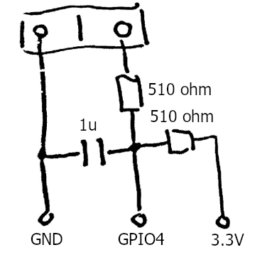
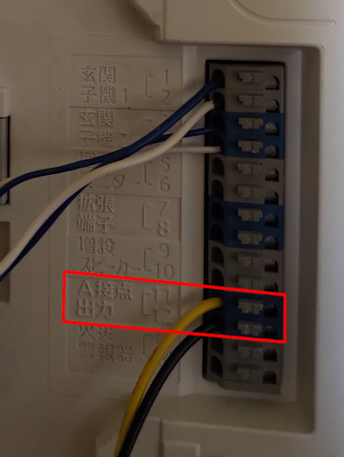
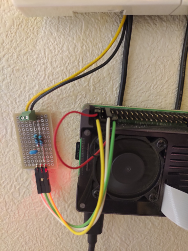
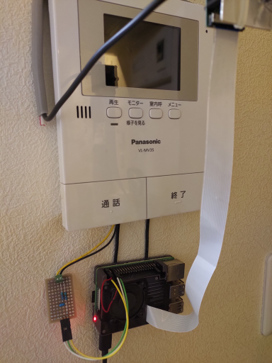

# ip-disco

RaspberryPiに接続されたインターホンの接点出力を監視し、Discordに通知をするアプリです。

## 主な機能

* インターホンからのa接点出力を監視してDiscordに投稿する
* 専用カメラから静止画を取得してDiscordに投稿する

## 使い方

1. Raspberry Piを用意します
1. チャタリング防止回路を作ります(fig.1)
1. Raspberry PiのIOピン(デフォは4)とチャタリング防止回路を繋ぎます
1. チャタリング防止回路とインターホンのa接点出力を繋ぎます(fig.2)
1. インターホンの画面が映るようにカメラをいい感じにセッティングします(fig.3)
1. Discordでサーバを作るかWebhook権限をもらいます
1. WebhookのURLを生成して設定ファイルの```discord.webhookUrl```に書きます
1. ```yarn```する
1. ```node index.js```で起動できます
1. お好みでsystemdにサービスを登録します

### Requirement

* RaspberryPi
* Node.js >= 14.16.1
* yarn (recommended)

## 補足

<details>
<summary>Systemd設定例</summary>

```
[Unit]
Description = IP Disco
After = systemd-networkd-wait-online.service

[Service]
WorkingDirectory=/home/pi/ip-disco
ExecStart = node /home/pi/ip-disco/index.js
Restart = always
Type = simple

[Install]
WantedBy = multi-user.target
```

</details>

  <details>
  <summary>fig.1 チャタリング防止回路</summary>



  </details>
  <details>
  <summary>fig.2 インターホンとの接続</summary>
  





  </details>
  <details>
  <summary>fig.3 全体図</summary>
  



  </details>


